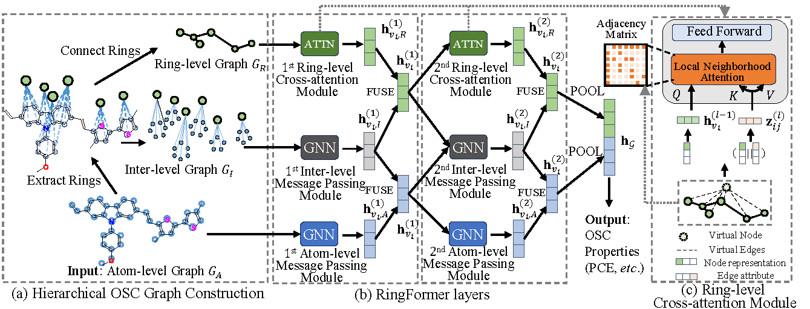

# RingFormer: A Ring-Enhanced Graph Transformer for Organic Solar Cell Property Prediction

This repository is an official PyTorch(Geometric) implementation of RingFormer in "RingFormer: A Ring-Enhanced Graph Transformer for Organic Solar Cell Property Prediction". 



## Requirements

To install requirements:

```setup
pip install -r requirements.txt
```

## Datasets

| DATASET   | #GRAPHS | AVG. # NODES | AVG. # EDGES | AVG. # RINGS |
| --------- | ------- | ------------ | ------------ | ------------ |
| CEPDB     | 2.2M    | 27.6         | 33.3         | 6.7          |
| HOPV      | 350     | 42.7         | 49.3         | 7.5          |
| PFD | 1055    | 77.1         | 84.2         | 8.2          |
| NFA       | 654     | 118.2        | 133.0        | 15.8         |
| PD      | 277     | 80.7         | 88.2         | 8.5          |

We provide two complementary dataset releases:

- **Processed ring-graph data (this GitHub repo):**  
  This repository includes the **processed ring graphs** used by RingFormer (e.g., ring-enhanced graph structures/tensors ready for training and evaluation). Please follow the instructions in this repo to generate/load the ring graphs and reproduce the paper results.

- **Raw CSV tables (🤗 Hugging Face):**  
  The **original/raw CSV datasets** (CEPDB / HOPV / PFD / NFA / PD) are hosted on Hugging Face at:  
  https://huggingface.co/datasets/Tommy-DING/organic-solar-cell-molecule-property-prediction  
  Use this release if you want to inspect the raw columns, reprocess the data with your own featurization, or build alternative graph constructions.

## Training & Evaluation
* To construct ring graphs, run this command:
```train
python generate_ring_graphs.py --dataset <dataset> 
```

* To train the model(s) in the paper, run this command:
```train
python train.py --dataset <dataset> 
```
--dataset: ('HOPV', 'PFD', 'NFA', 'PD', 'CEPDB')


## Citation
```bibtex
@inproceedings{ding2025ringformer,
  title={RingFormer: a ring-enhanced graph transformer for organic solar cell property prediction},
  author={Ding, Zhihao and Zhang, Ting and Li, Yiran and Shi, Jieming and Zhang, Chen Jason},
  booktitle={Proceedings of the AAAI Conference on Artificial Intelligence},
  volume={39},
  number={1},
  pages={155--163},
  year={2025}
}
```
